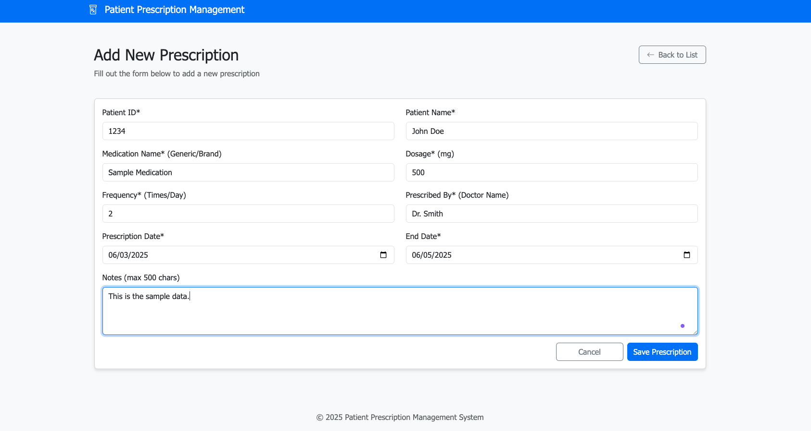
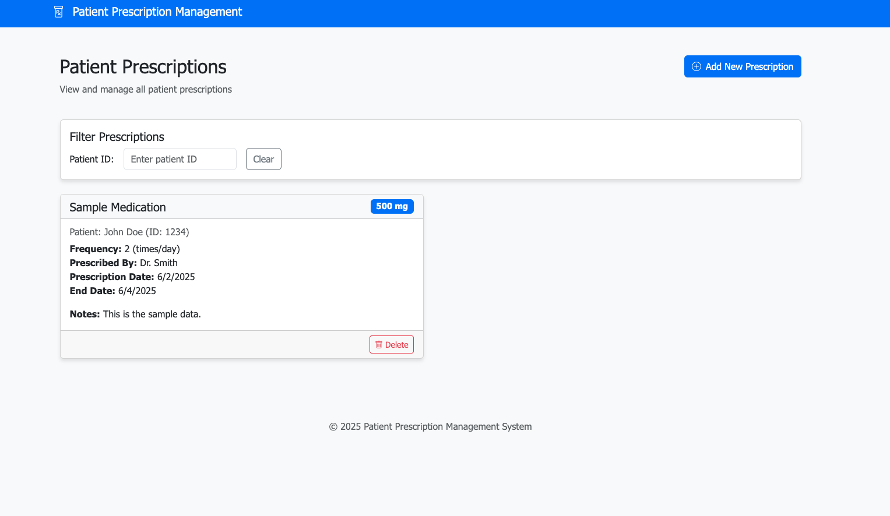
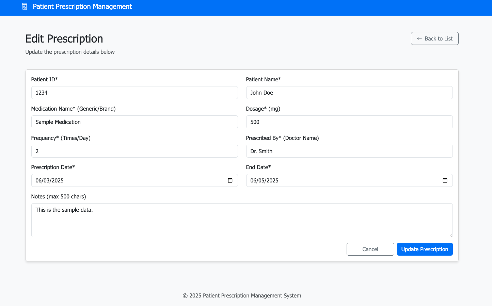
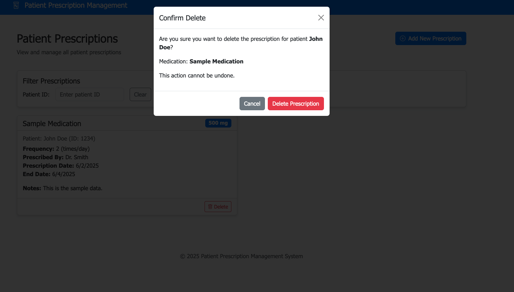

# Patient Prescription Management System

A comprehensive web application for managing patient prescriptions, built with Angular and .NET.

## Screenshots

### Dashboard View


### Add/Edit Prescription Form


### Validation in Action


### Mobile Responsive View


## Overview

The Patient Prescription Management System provides healthcare professionals with an intuitive interface to create, view, edit, and manage patient prescriptions. The application enforces strict input validation to ensure data integrity while maintaining a smooth user experience.

## Features

- **Prescription Dashboard**: View all prescriptions with filtering and sorting capabilities
- **Add/Edit Prescriptions**: Create new prescriptions or modify existing ones
- **Real-time Input Validation**: Strict validation prevents invalid data entry
- **Responsive Design**: Works seamlessly on desktop and mobile devices
- **Loading States**: Visual feedback during operations and navigation

## Technology Stack

### Frontend
- **Framework**: Angular 16+
- **UI Components**: Bootstrap 5
- **State Management**: Angular Services
- **HTTP Client**: Angular HttpClient
- **Form Handling**: Angular Reactive Forms

### Backend
- **Framework**: ASP.NET Core
- **API Architecture**: RESTful Web API
- **Database**: SQL Server / Entity Framework Core

## Input Validation Rules

The application enforces strict input validation with the following rules:

| Field           | Max Length | Character Types                      | Validation                                 |
|-----------------|------------|--------------------------------------|-------------------------------------------|
| Patient ID      | 10         | Numbers only                         | Required, numeric only                     |
| Patient Name    | 20         | Letters, spaces, periods, hyphens    | Required, min length 2, no numbers        |
| Medication Name | 20         | Letters, numbers, spaces, punctuation| Required, min length 2                    |
| Dosage          | 5          | Numbers, optional decimal            | Required, numeric with optional decimal    |
| Frequency       | 2          | Numbers only                         | Required, numeric only                     |
| Prescribed By   | 20         | Letters, spaces, periods, hyphens    | Required, min length 2, no numbers        |
| Notes           | 500        | Any characters                       | Optional                                   |

## Installation

### Prerequisites
- .NET SDK (v6.0+)
- Node.js (v14+)
- npm (v6+)
- Angular CLI (v16+)

### Setup Instructions

1. **Clone the repository**
   ```bash
   git clone <repository-url>
   cd patient-prescription
   ```

2. **Install dependencies**
   ```bash
   # Install server dependencies
   cd server
   npm install

   # Install client dependencies
   cd ../client
   npm install
   ```

3. **Start the development server**
   ```bash
   # Start the backend server (from the server directory)
   dotnet run

   # In a separate terminal, start the Angular development server (from the client directory)
   ng serve
   ```

4. **Access the application**
   - Open your browser and navigate to `http://localhost:4200`

## Usage Guide

### Viewing Prescriptions
- The home page displays all prescriptions in a card-based layout
- Use the search box to filter prescriptions by patient name, medication, etc.

### Adding a New Prescription
1. Click the "Add Prescription" button on the dashboard
2. Fill in all required fields (marked with *)
3. Click "Save Prescription" to create the prescription
4. You will be redirected to the dashboard with a success message

### Editing a Prescription
1. Click the "Edit" button on any prescription card
2. Modify the fields as needed
3. Click "Update Prescription" to save changes
4. You will be redirected to the dashboard with a success message

### Deleting a Prescription
1. Click the "Delete" button on any prescription card
2. Confirm the deletion when prompted
3. The prescription will be removed from the dashboard

## Project Structure

```
patient-prescription/
├── client/                 # Angular frontend
│   ├── src/
│   │   ├── app/
│   │   │   ├── components/ # Angular components
│   │   │   ├── directives/ # Custom directives
│   │   │   ├── models/     # Data models
│   │   │   ├── services/   # Angular services
│   │   │   └── app.routes.ts # Application routes
│   │   ├── assets/         # Static assets
│   │   └── environments/   # Environment configurations
│   └── package.json        # Frontend dependencies
└── server/                 # ASP.NET Core backend
    ├── Controllers/        # API controllers
    ├── Models/             # Data models
    ├── Services/           # Business logic services
    ├── Data/               # Database context and migrations
    ├── Program.cs          # Application entry point
    ├── Startup.cs          # Application configuration
    └── server.csproj       # .NET project file
```

## Development Notes

### Input Validation Implementation
- Real-time input validation is implemented using Angular's reactive forms and custom keydown event handlers
- Invalid keystrokes are prevented entirely rather than showing validation errors after input
- Maximum length restrictions are enforced at the keystroke level

### Loading State Management
- Loading states are managed using localStorage flags for cross-component communication
- Visual feedback is provided during operations with spinners and success messages

## License

[MIT License](LICENSE)

## Contributors

- [Your Name/Team]

---

© 2025 Patient Prescription Management System
